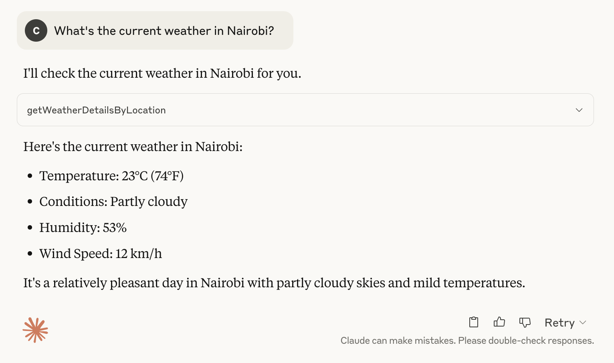
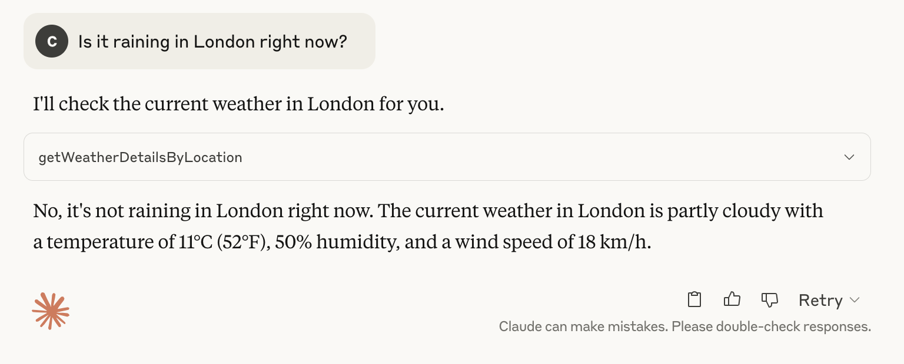
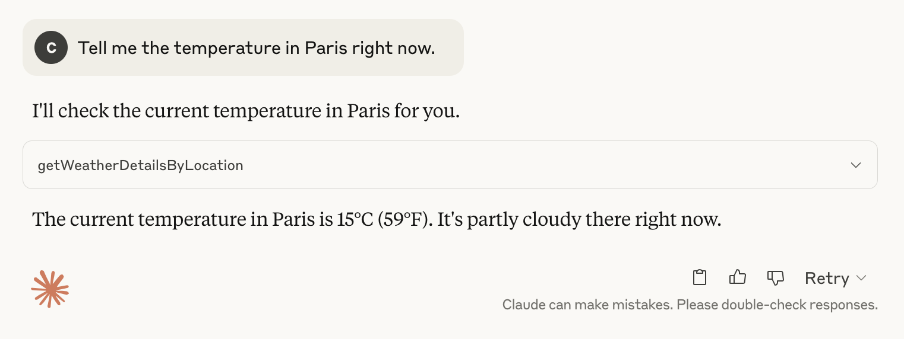

# MCP Weather Server - Java implementation

A simple Model Context Protocol (MCP) server that provides weather information for any location.

## What is MCP?

The [Model Context Protocol](https://modelcontextprotocol.io/introduction) (MCP) is a standardized way for AI applications and agents to connect with data sources and tools. It allows AI models like Claude to interact with your local system, external services, and custom tools through a standardized interface.

## Project Features

- Get current weather information for any location
- Compatible with Claude Desktop and other MCP clients
- Uses the free [wttr.in](https://wttr.in/) weather API (no API key required)

## Project Requirements

- Java 17 or later
- Maven 3.6 or later
- [Claude Desktop](https://claude.ai/download) for AI assistant integration (used as an MCP Client)

## Dependencies

This project relies on the following key components:

```xml
<dependencies>
    <dependency>
        <groupId>org.springframework.ai</groupId>
        <artifactId>spring-ai-starter-mcp-server</artifactId>
    </dependency>

    <dependency>
        <groupId>org.springframework</groupId>
        <artifactId>spring-web</artifactId>
    </dependency>
</dependencies>
```

## Building and Running

The server uses STDIO transport mode and is typically started automatically by the client.

### Clone the repository
The first step is to clone the project:
```bash
git clone https://github.com/chrischiedo/weather-mcp-server-java.git
cd weather-mcp-server-java
```

### Build the project
To build the server jar:

```bash
./mvnw clean install -DskipTests
```

### Run tests
To run tests, use:

```bash
./mvnw test
```

## Usage

### Running the server
Execute the jar file to start the MCP server:

```bash
java -jar target/weather-mcp-server-0.0.1-SNAPSHOT.jar
```

### Claude Desktop Integration

To integrate the MCP server with Claude Desktop, add the following configuration to your Claude Desktop config settings:

```json
{
  "mcpServers": {
    "mcp-weather-server": {
      "command": "java",
      "args": [
        "-Dspring.ai.mcp.server.stdio=true",
        "-jar",
        "/absolute/path/to/weather-mcp-server-0.0.1-SNAPSHOT.jar"
      ]
    }
  }
}
```

**Note**: On MacOS, the config settings file can be opened using:

```bash
vi ~/Library/Application\ Support/Claude/claude_desktop_config.json
```

**Note**: Remember to replace `/absolute/path/to/` with the actual path to your built jar file.

### Example prompts for Claude Desktop

Once connected, you can ask Claude to use the weather tool:

<details>
<summary>1. "What's the current weather in Nairobi?"</summary>


</details>

<details>
<summary>2. "Is it raining in London right now?"</summary>


</details>

<details>
<summary>3. "Tell me the temperature in Paris right now."</summary>


</details>

**Note**: The prompts above were taken on _4th May 2025_.

## How it works

This server implements the Model Context Protocol to provide a tool that fetches weather data from the [wttr.in](https://wttr.in/) API. When Claude or another MCP client connects to this server, they can use the `getWeatherDetailsByLocation` tool to retrieve current weather conditions for any location.

## Extending the server

You can extend this server by:

1. Adding more weather-related tools (forecast, historical data, etc.)
2. Implementing other MCP features like resources or prompts
3. Using a different weather API with more features (for example, [wunderground](https://www.wunderground.com/weather/api))

## License

This project is open source and available under the [MIT License](LICENSE).

## Further Resources

- [Introducing the Model Context Protocol](https://www.anthropic.com/news/model-context-protocol)
- [Model Context Protocol Specification](https://modelcontextprotocol.io/specification/)
- [MCP Server Boot Starter](https://docs.spring.io/spring-ai/reference/api/mcp/mcp-server-boot-starter-docs.html)
